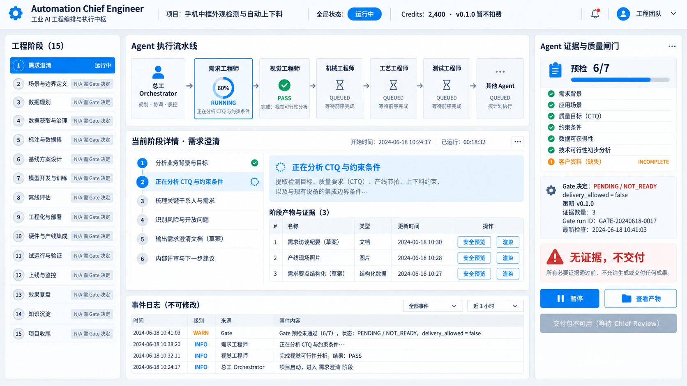
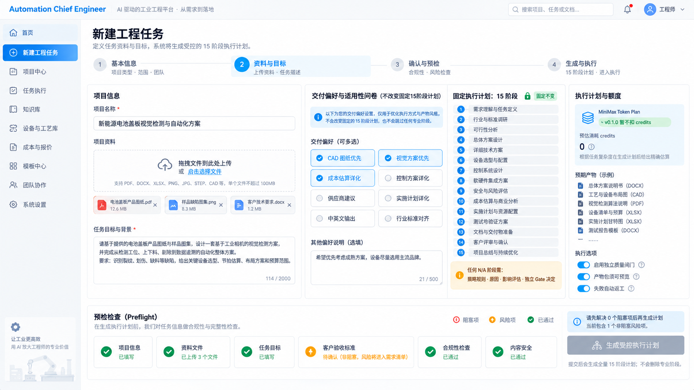
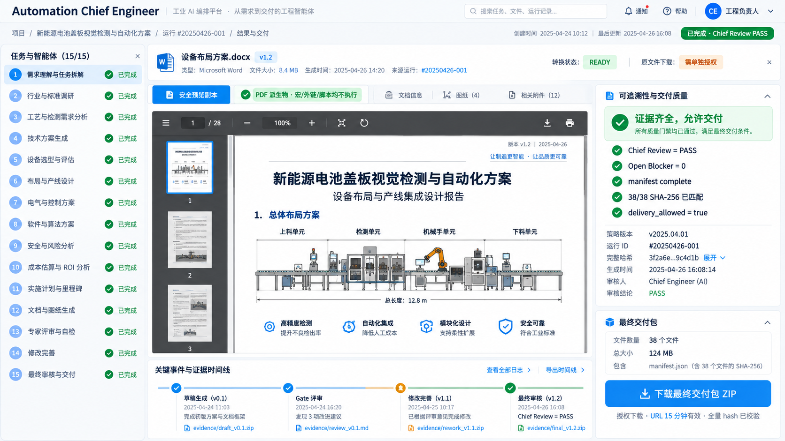

# Automation Chief Engineer Cloud — 用户操作说明（目标态）

> 这是 v0.1.0 的目标产品手册，功能尚未上线；示例界面与状态只用于说明，不是已运行系统。

## 1. 开始前

- 使用受支持的现代桌面浏览器（具体清单 TBD）。
- 准备项目名称、清楚的方案目标和相关资料。不要上传密码、未获授权的第三方资料或恶意可执行文件。
- 页面会显示 credits；**v0.1.0 创建和启动任务暂不扣 credits**，预估值不是收费记录。

## 2. 注册与登录

1. 打开未来的 `https://zg.gaona.world`（仅在正式上线并验证后可用）。
2. 选择“注册”，输入邮箱、显示名和符合密码规则的密码；完成后按最终认证策略登录/验证。
3. 登录后，在右上角检查账户和 credits。若看到登录失败、账户禁用或频率受限，请依据安全提示稍后再试或联系管理员。

## 3. 创建并启动任务

1. 在“任务中心”点“新建任务”。
2. 填写项目名称和目标提示词。写清交付目标、已知限制、输入事实和希望的格式；不确定的信息应明确标为待确认。
3. 上传资料。每个文件需要完成安全检查，状态为 `SAFE` 后才可以用于任务。
4. 保存草稿可稍后继续。点击“开始方案”后，系统会核验必填字段和输入状态。
5. 成功提交会显示 `QUEUED`，随后总工开始建立执行计划。重复点击不会产生重复任务。

## 4. 阅读任务命令中心

- **顶部流水线**：从总工到各专业 Agent 再到独立 Gatekeeper 的依赖顺序。每张卡显示文字状态、当前任务摘要和进度。
- **左侧任务树**：快速切换阶段。编号表示流程位置，而不是完成承诺。
- **中央详情**：当前 Agent 将要做什么、正做什么、已经生成什么。展开步骤即可查看输入依据、产物版本和返工记录。
- **右侧质量面板**：显示检查项目、证据来源、质量诊断分和 Gate 决定。只有 Gate PASS 且 `delivery_allowed` 才能继续进入最终交付。
- **底部事件日志**：按时间查看总工和各 Agent 的结构化事件。连接断开时会显示最后更新时间；重新连接或刷新后系统自动补齐事件。

## 4.1 新建任务工作室（v2 参考）

新建任务页将输入目标、附件安全状态、固定总工计划和启动前检查放在同一工作区。提交前应确认必填内容已完成、附件可用、计划未被误解为已执行，且 credits 区域明确说明 v0.1.0 不扣积分。

## 4.2 产物预览与最终交付（v2 参考）

产物页将预览、版本、来源证据、质量门与交付操作分开显示。用户只能对拥有权限且通过交付门禁的最终包取得短期下载链接；“预览可见”不等于“已通过交付质量门”。

> 以上三张带 `-v2-` 的图片是本版本的唯一实现参考。没有 `-v2-` 后缀的旧版图片仅作为 QA/审计留档，不能用来判断最终界面状态。图片中的示例名称、时间、百分比、质量分和 credits 都是演示数据，不代表系统已经实现或在运行。

常用状态：

| 状态 | 含义 | 你可以做什么 |
|---|---|---|
| `DRAFT` / `INPUT_REQUIRED` | 资料或字段尚不完整 | 编辑、上传、重新提交。 |
| `QUEUED` | 已接收，等待或准备执行 | 查看计划；如有权限可取消。 |
| `RUNNING` / `REWORKING` | 总工或专业 Agent 正在工作/返工 | 查看进度、产物与证据；可请求暂停。 |
| `PAUSED` | 在安全检查点暂停 | 查看结果、恢复或取消。 |
| `QUALITY_BLOCKED` | 质量/安全/事实问题无法自动解决 | 查看问题和证据；联系管理员补件或处理。 |
| `FAILED` | 运行出现故障 | 查看失败事件；owner/admin 可按策略重试。 |
| `PACKAGED` | 最终包已通过 manifest/hash 门禁 | 查看产物并下载 ZIP。 |

## 5. 查看产物与预览

点开某一 Agent 的步骤或“查看产物”：

1. 确认该产物的版本、来源 Agent、Gate 结论与输入证据。
2. 图片、PDF、文本将在安全 viewer 中直接预览。
3. Office 文件若显示“转换中”请等待；若显示“不可预览/转换失败”，不代表文件一定失败，可在授权后下载原始文件。系统不会运行 Office 宏或外部链接。
4. 标有返工/隔离/未批准的版本不能成为最终交付的一部分。

## 6. 下载最终交付包

任务为 `PACKAGED` 后选择“打开交付包”或“下载”。下载链接有有效期且与当前授权绑定；过期时重新从任务页获取。最终 ZIP 中只包含通过总工与质量门的批准资产，并带 manifest 与哈希清单。

## 7. 角色差异

- **成员**：创建、管理自己任务及其文件；可访问获授权内容。
- **审阅者**：仅查看被授予任务、证据和已准许下载内容。
- **管理员**：管理账户/策略/阻塞处理并审计操作；也不能把未通过质量门的任务直接标记交付。

## 8. 隐私与支持

不要通过提示词或附件提交密码、API key、支付信息等秘密。遇到疑似越权、异常下载、质量阻塞或上传扫描失败时，请记录任务 ID、发生时间与页面显示的 request ID 联系管理员；请勿把受限文件通过其他渠道公开发送。
